## Visão Geral

O fluxo de integração de boletos bancários envolve desde a criação do boleto até a confirmação do pagamento. Este guia apresenta o passo a passo completo para implementar boletos em sua aplicação.

## Fluxo Completo

```mermaid
graph TB
    A[1. Cliente Escolhe Boleto] --> B[2. Sua Aplicação Chama API]
    B --> C[3. FireBanking Registra Boleto]
    C --> D[4. Boleto Retornado]
    D --> E[5. Cliente Visualiza/Baixa]
    E --> F[6. Cliente Paga no Banco]
    F --> G[7. Banco Processa Pagamento]
    G --> H[8. Webhook Enviado]
    H --> I[9. Sua Aplicação Confirma]
    I --> J[10. Cliente Notificado]
```



## Etapas Detalhadas

### 1. Configuração Inicial

<Steps>
  <Step title="Obter Credenciais">
    Configure suas chaves de API no Dashboard da FireBanking
  </Step>
  <Step title="Configurar Webhooks">
    Defina endpoints para receber notificações de pagamento
  </Step>
  <Step title="Ambiente de Testes">
    Implemente primeiro em sandbox para validar a integração
  </Step>
</Steps>

### 2. Criação do Boleto

#### Frontend - Interface de Pagamento
```html
<form id="boleto-form">
  <div class="payment-methods">
    <label>
      <input type="radio" name="payment" value="boleto">
      💳 Boleto Bancário
    </label>
  </div>

  <div id="boleto-details" style="display: none;">
    <h3>Dados para o Boleto</h3>

    <div class="form-group">
      <label>Nome Completo *</label>
      <input type="text" id="buyer-name" required>
    </div>

    <div class="form-group">
      <label>CPF/CNPJ *</label>
      <input type="text" id="buyer-document" required>
    </div>

    <div class="form-group">
      <label>Email *</label>
      <input type="email" id="buyer-email" required>
    </div>

    <div class="form-group">
      <label>CEP *</label>
      <input type="text" id="buyer-cep" required>
    </div>

    <div id="address-fields">
      <!-- Campos de endereço preenchidos automaticamente -->
    </div>

    <button type="submit">Gerar Boleto</button>
  </div>
</form>
```

#### JavaScript - Criação do Boleto
```javascript
async function createBoleto(orderData) {
  const boletoData = {
    amount: orderData.total * 100, // Converter para centavos
    due_date: calculateDueDate(15), // 15 dias a partir de hoje
    description: `Pedido #${orderData.id} - ${orderData.description}`,
    external_id: `order-${orderData.id}`,
    buyer: {
      name: document.getElementById('buyer-name').value,
      document: document.getElementById('buyer-document').value,
      email: document.getElementById('buyer-email').value,
      address: getAddressFromForm()
    },
    callback_url: 'https://meusite.com/webhooks/boleto',
    metadata: {
      order_id: orderData.id,
      customer_id: orderData.customer_id
    }
  };

  try {
    const response = await fetch('/api/create-boleto', {
      method: 'POST',
      headers: {
        'Content-Type': 'application/json'
      },
      body: JSON.stringify(boletoData)
    });

    const boleto = await response.json();

    if (response.ok) {
      showBoletoSuccess(boleto);
    } else {
      showError(boleto.error);
    }
  } catch (error) {
    console.error('Erro ao criar boleto:', error);
    showError('Erro interno. Tente novamente.');
  }
}

function calculateDueDate(days) {
  const date = new Date();
  date.setDate(date.getDate() + days);
  return date.toISOString().split('T')[0];
}
```

#### Backend - Endpoint para Criar Boleto
```javascript
// Node.js/Express
app.post('/api/create-boleto', async (req, res) => {
  try {
    const boletoData = req.body;

    // Validar dados do cliente
    if (!validateBoletoData(boletoData)) {
      return res.status(400).json({
        error: 'Dados inválidos'
      });
    }

    // Chamar API da FireBanking
    const response = await fetch('https://api-gateway.firebanking.com.br/v1/payment', {
      method: 'POST',
      headers: {
        'x-api-key': process.env.FIREBANKING_API_KEY,
        'Content-Type': 'application/json'
      },
      body: JSON.stringify(boletoData)
    });

    const boleto = await response.json();

    if (response.ok) {
      // Salvar boleto no banco de dados
      await saveBoleto(boleto);

      res.json(boleto);
    } else {
      res.status(response.status).json(boleto);
    }
  } catch (error) {
    console.error('Erro ao criar boleto:', error);
    res.status(500).json({ error: 'Erro interno do servidor' });
  }
});
```

### 3. Exibição do Boleto

#### Interface de Sucesso
```html
<div id="boleto-success" class="payment-success">
  <h2>✅ Boleto Gerado com Sucesso!</h2>

  <div class="boleto-info">
    <div class="info-row">
      <span class="label">Valor:</span>
      <span class="value" id="boleto-value">R$ 250,00</span>
    </div>
    <div class="info-row">
      <span class="label">Vencimento:</span>
      <span class="value" id="boleto-due">15/02/2024</span>
    </div>
    <div class="info-row">
      <span class="label">Código de Barras:</span>
      <div class="barcode-container">
        <input type="text" id="boleto-barcode" readonly>
        <button onclick="copyBarcode()" title="Copiar">📋</button>
      </div>
    </div>
  </div>

  <div class="boleto-actions">
    <a href="#" id="boleto-pdf" class="btn-primary" target="_blank">
      📄 Visualizar Boleto
    </a>
    <button onclick="sendEmail()" class="btn-secondary">
      📧 Enviar por Email
    </button>
  </div>

  <div class="payment-instructions">
    <h4>Como Pagar:</h4>
    <ul>
      <li>📱 <strong>App do Banco:</strong> Escaneie o código de barras</li>
      <li>💻 <strong>Internet Banking:</strong> Use a linha digitável</li>
      <li>🏪 <strong>Agência/Lotérica:</strong> Apresente o boleto impresso</li>
    </ul>
  </div>
</div>
```

#### JavaScript - Exibir Boleto
```javascript
function showBoletoSuccess(boleto) {
  // Esconder formulário de pagamento
  document.getElementById('boleto-form').style.display = 'none';

  // Exibir dados do boleto
  document.getElementById('boleto-value').textContent =
    formatCurrency(boleto.amount);

  document.getElementById('boleto-due').textContent =
    formatDate(boleto.due_date);

  document.getElementById('boleto-barcode').value = boleto.digitable_line;
  document.getElementById('boleto-pdf').href = boleto.pdf_url;

  // Mostrar tela de sucesso
  document.getElementById('boleto-success').style.display = 'block';

  // Iniciar verificação de status
  startStatusCheck(boleto.id);
}
```

### 4. Verificação de Status

#### Polling de Status
```javascript
function startStatusCheck(boletoId) {
  const checkInterval = setInterval(async () => {
    try {
      const response = await fetch(`/api/boleto-status/${boletoId}`);
      const status = await response.json();

      if (status.paid) {
        clearInterval(checkInterval);
        showPaymentConfirmed(status);
      } else if (status.expired) {
        clearInterval(checkInterval);
        showBoletoExpired(status);
      }
    } catch (error) {
      console.error('Erro ao verificar status:', error);
    }
  }, 30000); // Verificar a cada 30 segundos

  // Parar verificação após 2 horas
  setTimeout(() => {
    clearInterval(checkInterval);
  }, 2 * 60 * 60 * 1000);
}
```

### 5. Webhook de Confirmação

#### Endpoint do Webhook
```javascript
// Endpoint para receber confirmações
app.post('/webhooks/boleto', express.raw({type: 'application/json'}), async (req, res) => {
  try {
    const payload = JSON.parse(req.body);

    // Verificar assinatura (opcional, mas recomendado)
    if (!verifyWebhookSignature(req.headers, req.body)) {
      return res.status(401).send('Assinatura inválida');
    }

    // Processar evento
    await processBoletoWebhook(payload);

    res.status(200).send('OK');
  } catch (error) {
    console.error('Erro no webhook:', error);
    res.status(500).send('Erro interno');
  }
});

async function processBoletoWebhook(payload) {
  const { event, boleto_id, data } = payload;

  switch (event) {
    case 'boleto.paid':
      await handleBoletoPaid(boleto_id, data);
      break;

    case 'boleto.expired':
      await handleBoletoExpired(boleto_id, data);
      break;

    case 'boleto.cancelled':
      await handleBoletoCancelled(boleto_id, data);
      break;
  }
}

async function handleBoletoPaid(boletoId, data) {
  // Atualizar status no banco
  await updateBoletoStatus(boletoId, 'paid', data);

  // Processar pedido (liberar produto, enviar confirmação, etc.)
  await processOrder(data.external_id);

  // Notificar cliente
  await sendPaymentConfirmation(data.buyer.email, data);
}
```

### 6. Notificação ao Cliente

#### Email de Confirmação
```javascript
async function sendPaymentConfirmation(email, boletoData) {
  const emailData = {
    to: email,
    subject: 'Pagamento Confirmado ✅',
    html: `
      <h2>Pagamento Confirmado!</h2>
      <p>Olá! Confirmamos o recebimento do pagamento do seu boleto.</p>

      <div style="background: #f5f5f5; padding: 20px; border-radius: 8px;">
        <h3>Detalhes do Pagamento:</h3>
        <p><strong>Valor:</strong> ${formatCurrency(boletoData.paid_amount)}</p>
        <p><strong>Data:</strong> ${formatDate(boletoData.paid_at)}</p>
        <p><strong>Referência:</strong> ${boletoData.external_id}</p>
      </div>

      <p>Seu pedido será processado em breve.</p>

      <p>Obrigado por escolher nossos serviços!</p>
    `
  };

  await sendEmail(emailData);
}
```

## Tratamento de Erros

### Códigos de Erro Comuns
```javascript
function handleBoletoError(error) {
  const errorMessages = {
    'INVALID_AMOUNT': 'Valor deve estar entre R$ 2,50 e R$ 50.000,00',
    'INVALID_DUE_DATE': 'Data de vencimento deve ser entre hoje e 90 dias',
    'INVALID_DOCUMENT': 'CPF ou CNPJ inválido',
    'INVALID_EMAIL': 'Email inválido',
    'EXTERNAL_ID_EXISTS': 'Esta transação já foi processada',
    'REGISTRATION_FAILED': 'Erro no registro bancário. Tente novamente.'
  };

  const message = errorMessages[error.code] || 'Erro desconhecido';
  showErrorMessage(message);
}
```

### Retry Logic
```javascript
async function createBoletoWithRetry(boletoData, maxRetries = 3) {
  for (let attempt = 1; attempt <= maxRetries; attempt++) {
    try {
      const response = await createBoleto(boletoData);
      return response;
    } catch (error) {
      if (attempt === maxRetries) {
        throw error;
      }

      // Aguardar antes de tentar novamente
      await new Promise(resolve => setTimeout(resolve, 1000 * attempt));
    }
  }
}
```

## Boas Práticas

### Segurança
<AccordionGroup>
  <Accordion title="Validação de Dados">
    - Valide CPF/CNPJ no frontend e backend
    - Sanitize todos os inputs do usuário
    - Verifique assinatura dos webhooks
    - Use HTTPS em todos os endpoints
  </Accordion>

  <Accordion title="Armazenamento">
    - Não armazene dados sensíveis desnecessários
    - Criptografe informações pessoais
    - Implemente logs de auditoria
    - Faça backup dos dados de transação
  </Accordion>
</AccordionGroup>

### Performance
<AccordionGroup>
  <Accordion title="Cache">
    - Cache dados de endereço (CEP)
    - Mantenha cache de status de boletos
    - Use CDN para arquivos PDF
    - Implemente rate limiting
  </Accordion>

  <Accordion title="Otimização">
    - Processe webhooks de forma assíncrona
    - Use conexões persistentes para APIs
    - Implemente timeout adequado
    - Monitore performance dos endpoints
  </Accordion>
</AccordionGroup>

### Experiência do Usuário
<AccordionGroup>
  <Accordion title="Interface">
    - Autopreenchimento de endereço por CEP
    - Validação em tempo real
    - Feedback visual de status
    - Instruções claras de pagamento
  </Accordion>

  <Accordion title="Comunicação">
    - Emails transacionais bem formatados
    - Notificações push quando possível
    - Status transparente do pagamento
    - Suporte para dúvidas
  </Accordion>
</AccordionGroup>

## Monitoramento

### Métricas Importantes
```javascript
// Exemplo de métricas para monitorar
const metrics = {
  // Taxa de conversão
  conversion_rate: boletos_pagos / boletos_criados,

  // Tempo médio de pagamento
  avg_payment_time: soma_tempo_pagamento / boletos_pagos,

  // Taxa de expiração
  expiration_rate: boletos_expirados / boletos_criados,

  // Valores
  total_amount: soma_valores_pagos,
  avg_ticket: soma_valores_pagos / boletos_pagos
};
```

### Alertas
- Taxa de erro acima de 5%
- Webhooks não processados
- Tempo de resposta alto
- Falhas na criação de boletos

## Próximos Passos

<CardGroup cols={2}>
  <Card title="Criar Boleto" href="/api-reference/bank-slip/create">
    Implemente a criação de boletos
  </Card>
  <Card title="Consultar Status" href="/api-reference/bank-slip/get">
    Verifique status dos boletos
  </Card>
  <Card title="Configurar Webhooks" href="/api-reference/bank-slip/webhook-paid">
    Receba notificações automáticas
  </Card>
  <Card title="Ambiente de Testes" href="/testing">
    Teste sua integração
  </Card>
</CardGroup>