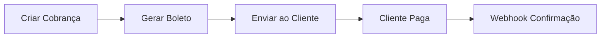
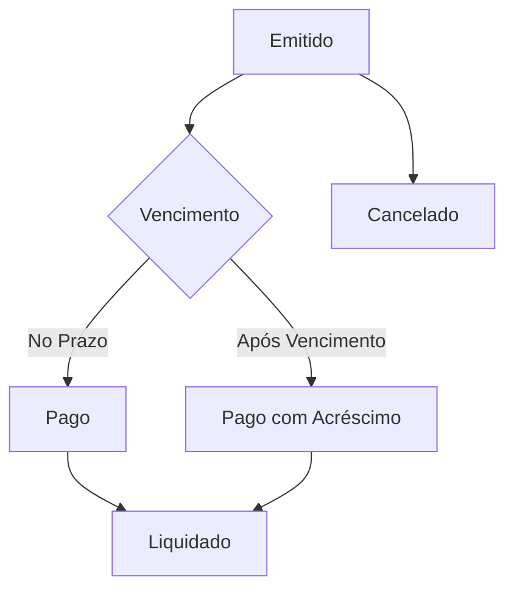

## Visão Geral

O **Boleto Bancário** é um dos métodos de pagamento mais populares no Brasil, oferecendo uma forma segura e amplamente aceita para receber pagamentos de clientes que preferem não usar cartão de crédito ou não possuem conta bancária.

<CardGroup cols={2}>
  <Card title="Emissão Simplificada" icon="file-invoice">
    **Gere boletos**: Crie boletos com dados do pagador e vencimento flexível
  </Card>
  <Card title="Pagamento Universal" icon="building">
    **Aceito em qualquer banco**: Cliente pode pagar em agências, internet banking, apps ou lotéricas
  </Card>
</CardGroup>

## Características Principais

### Ampla Aceitação
- **Qualquer banco**: Pagável em qualquer instituição bancária do Brasil
- **Múltiplos canais**: Agências, internet banking, apps, ATMs e lotéricas
- **Sem conta bancária**: Cliente não precisa ter conta para pagar
- **Código de barras**: Pagamento por leitura ótica ou digitação

### Flexibilidade de Prazo
- **Vencimento configurável**: Defina o prazo ideal para seu negócio
- **Pagamento após vencimento**: Aceita pagamento com multa e juros
- **Prorrogação**: Possibilidade de estender prazo de vencimento
- **Cancelamento**: Cancele boletos não pagos a qualquer momento

### Custos Previsíveis
- **Taxa fixa**: Valor fixo por boleto, independente do valor
- **Sem taxa de cancelamento**: Cancele sem custos adicionais
- **Transparência total**: Sem tarifas ocultas ou surpresas
- **Ideal para valores altos**: Custo baixo para transações acima de R$ 200

## Tipos de Boleto

### Boleto Registrado
<AccordionGroup>
  <Accordion title="Características">
    - Registrado no banco emissor
    - Maior segurança e controle
    - Permite pagamento após vencimento
    - Rastreamento completo da cobrança
  </Accordion>
  
  <Accordion title="Ideal Para">
    - E-commerce e vendas online
    - Cobranças recorrentes
    - Valores acima de R$ 200
    - Empresas que precisam de conciliação automática
  </Accordion>
</AccordionGroup>

### Boleto com Multa e Juros
<AccordionGroup>
  <Accordion title="Configuração Automática">
    - Multa de 2% após vencimento
    - Juros de 0,033% ao dia (1% ao mês)
    - Calculado automaticamente pelo banco
    - Valor atualizado em tempo real
  </Accordion>
  
  <Accordion title="Benefícios">
    - Incentiva pagamento no prazo
    - Compensa atraso com receita adicional
    - Reduz inadimplência
    - Padrão de mercado
  </Accordion>
</AccordionGroup>

## Fluxo de Pagamento

### Geração do Boleto


### Ciclo de Vida do Boleto


## Prazos e Limitações

### Prazos de Vencimento
- **Mínimo**: 1 dia após emissão
- **Máximo**: 90 dias após emissão  
- **Recomendado**: 3 a 15 dias para e-commerce
- **Pagamento após vencimento**: Até 90 dias com multa e juros

### Valores
- **Mínimo**: R$ 2,50
- **Máximo**: R$ 50.000,00 por boleto
- **Ideal**: Valores acima de R$ 50 (melhor custo-benefício)
- **Sem limite mensal**: Pode emitir quantos boletos precisar

### Horários de Processamento
- **Compensação**: D+1 útil após pagamento
- **Fins de semana**: Pagamentos processados na segunda-feira
- **Feriados bancários**: Não há processamento
- **Confirmação**: Webhook enviado em até 4 horas úteis

## Dados Obrigatórios

### Informações do Pagador
<AccordionGroup>
  <Accordion title="Pessoa Física (CPF)">
    - Nome completo (sem abreviações)
    - CPF válido (apenas números)
    - Endereço completo com CEP
    - Email para envio do boleto
  </Accordion>
  
  <Accordion title="Pessoa Jurídica (CNPJ)">
    - Razão social ou nome fantasia
    - CNPJ válido (apenas números)
    - Endereço completo com CEP
    - Email para envio do boleto
  </Accordion>
</AccordionGroup>

### Informações da Cobrança
- **Valor**: Em reais (formato decimal, ex: 100.00)
- **Vencimento**: Data futura (máximo 90 dias)
- **Descrição**: Detalhamento do produto/serviço
- **Identificador**: Seu ID único da transação

## Recursos Disponíveis

### Emissão e Gestão
- **Criar boleto**: Emita novos boletos via API
- **Consultar status**: Verifique situação em tempo real
- **Gerar PDF**: Download do arquivo para impressão/envio
- **Cancelar boleto**: Cancele boletos não pagos

### Notificações Automáticas
- **Webhook de confirmação**: Pagamento processado
- **Webhook de cancelamento**: Boleto cancelado
- **Email automático**: Envio do boleto para o cliente
- **SMS (opcional)**: Notificação de cobrança

### Conciliação
- **ID único**: Cada boleto tem identificador exclusivo
- **Nosso número**: Referência bancária do boleto
- **Dados do pagador**: Informações completas para reconciliação
- **Data de pagamento**: Timestamp exato da liquidação

## Ambientes Disponíveis

<CardGroup cols={2}>
  <Card title="Sandbox" icon="flask">
    **Base URL**: `https://api-gateway.firebanking.dev`

    Boletos simulados para desenvolvimento
  </Card>
  <Card title="Produção" icon="globe">
    **Base URL**: `https://api-gateway.firebanking.com.br`

    Boletos registrados no sistema bancário
  </Card>
</CardGroup>

## Casos de Uso Ideais

### E-commerce B2C
- **Clientes sem cartão**: Atende público que prefere boleto
- **Valores médios-altos**: Acima de R$ 100 para compensar taxa
- **Prazo flexível**: Cliente pode pagar quando for conveniente
- **Checkout alternativo**: Opção adicional ao cartão e PIX

### B2B e Corporativo
- **Processo de aprovação**: Empresas que precisam de aprovação interna
- **Pagamento à vista**: Transferência de recursos entre contas
- **Comprovação**: Documento oficial de pagamento
- **Planejamento financeiro**: Prazo definido para pagamento

### Serviços Recorrentes
- **Mensalidades**: Escolas, academias, assinaturas
- **Prestação de serviços**: Consultorias, profissionais liberais
- **Parcelamentos**: División de valores em múltiplos boletos
- **Cobrança programada**: Geração automática mensal

## Integração Frontend

### Exibir Boleto
```html
<div id="boleto-payment">
  <h3>Boleto Bancário</h3>
  <div class="boleto-info">
    <p><strong>Valor:</strong> R$ <span id="boleto-amount"></span></p>
    <p><strong>Vencimento:</strong> <span id="boleto-due-date"></span></p>
    <p><strong>Código de Barras:</strong></p>
    <input type="text" id="boleto-barcode" readonly />
  </div>
  <div class="boleto-actions">
    <button onclick="downloadBoleto()" class="btn-primary">
      📄 Baixar PDF
    </button>
    <button onclick="copyBarcode()" class="btn-secondary">
      📋 Copiar Código
    </button>
  </div>
  <p class="boleto-note">
    💡 Você pode pagar este boleto em qualquer banco, app bancário ou lotérica
  </p>
</div>
```

### Implementação JavaScript
```javascript
function showBoletoPayment(boletoData) {
  // Exibir informações do boleto
  document.getElementById('boleto-amount').textContent = 
    boletoData.amount.toLocaleString('pt-BR', {
      style: 'currency',
      currency: 'BRL'
    });
  
  document.getElementById('boleto-due-date').textContent = 
    new Date(boletoData.due_date).toLocaleDateString('pt-BR');
  
  document.getElementById('boleto-barcode').value = boletoData.barcode;
}

function downloadBoleto() {
  // Abrir PDF do boleto
  window.open(boletoData.pdf_url, '_blank');
}

function copyBarcode() {
  const barcodeInput = document.getElementById('boleto-barcode');
  barcodeInput.select();
  navigator.clipboard.writeText(barcodeInput.value);
  alert('Código copiado! Cole no app do seu banco.');
}
```

## Primeiros Passos

<Steps>
  <Step title="Configure sua conta">
    Ative o Boleto em sua conta FireBanking através do Dashboard
  </Step>
  <Step title="Teste no Sandbox">
    Emita boletos de teste para familiarizar-se com a API
  </Step>
  <Step title="Configure Webhooks">
    Implemente endpoints para receber confirmações de pagamento
  </Step>
  <Step title="Customize templates">
    Personalize o layout dos boletos com sua marca
  </Step>
  <Step title="Vá para produção">
    Ative suas credenciais de produção e comece a emitir boletos reais
  </Step>
</Steps>

## Próximos Passos

<CardGroup cols={2}>
  <Card title="Criar Boleto" icon="plus" href="/api-reference/boleto/create">
    Aprenda a emitir seu primeiro boleto
  </Card>
  <Card title="Consultar Status" icon="search" href="/api-reference/boleto/get">
    Verifique o status de pagamento
  </Card>
  <Card title="Webhooks Boleto" icon="webhook" href="/api-reference/boleto/webhook-paid">
    Configure notificações automáticas
  </Card>
  <Card title="Ambiente de Testes" icon="flask" href="/testing">
    Use dados de teste para desenvolvimento
  </Card>
</CardGroup>

<Info>
  **Dica**: Boletos são ideais para valores acima de R$ 50, onde a taxa fixa se torna mais competitiva comparada às taxas percentuais de cartão e PIX.
</Info>