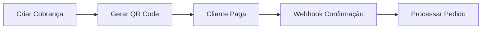
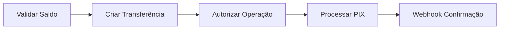

## Visão Geral

O **PIX** é o sistema de pagamentos instantâneos brasileiro que permite transferências e recebimentos em tempo real, funcionando 24 horas por dia, 7 dias por semana, incluindo finais de semana e feriados.

<CardGroup cols={2}>
  <Card title="PIX Cobrança (Cash In)" icon="money-bill-transfer">
    **Receba pagamentos**: Gere QR Codes ou cobranças por chave PIX para receber valores de seus clientes
  </Card>
  <Card title="PIX Saque (Cash Out)" icon="hand-holding-dollar">
    **Realize transferências**: Envie valores para chaves PIX ou contas bancárias de terceiros
  </Card>
</CardGroup>

## Características Principais

### Pagamentos Instantâneos
- **Confirmação em segundos**: Transações processadas e confirmadas em até 10 segundos
- **Disponibilidade 24/7**: Funciona todos os dias, incluindo finais de semana e feriados
- **Liquidação imediata**: Valores disponíveis instantaneamente após confirmação

### Flexibilidade de Integração
- **QR Code Dinâmico**: Gere QR Codes únicos para cada transação
- **Chaves PIX**: Aceite pagamentos via CPF, CNPJ, email, telefone ou chave aleatória
- **APIs v1 e v2**: Suporte a versões antigas e modernas da API

### Custos Reduzidos
- **Taxas baixas**: Custos significativamente menores comparado ao cartão de crédito
- **Sem tarifa para pessoa física**: Ideal para pequenos negócios e startups
- **Transparência total**: Sem custos ocultos ou taxas surpresa

## Tipos de Operação

### PIX Cobrança (Cash In)
Receba pagamentos de clientes através de:

<AccordionGroup>
  <Accordion title="QR Code Dinâmico">
    - QR Code único para cada transação
    - Valor e dados do beneficiário pré-definidos
    - Ideal para e-commerce e checkout
    - Expiração configurável
  </Accordion>
  
  <Accordion title="Cobrança por Chave">
    - Cliente insere sua chave PIX
    - Valor solicitado via notificação
    - Processo simplificado
    - Menor fricção para o pagador
  </Accordion>
  
  <Accordion title="Link de Pagamento">
    - URL personalizada para pagamento
    - Compartilhamento via WhatsApp, email, SMS
    - Ideal para vendas à distância
    - Rastreamento de conversão
  </Accordion>
</AccordionGroup>

### PIX Saque (Cash Out)
Realize transferências para:

<AccordionGroup>
  <Accordion title="Chave PIX">
    - CPF, CNPJ, email, telefone
    - Chave aleatória (EVP)
    - Validação automática de dados
    - Transferência direta
  </Accordion>
  
  <Accordion title="Dados Bancários">
    - Banco, agência, conta
    - Validação de titularidade
    - Suporte a conta corrente e poupança
    - Transferência tradicional via PIX
  </Accordion>
  
  <Accordion title="QR Code Estático">
    - Leitura de QR Code do beneficiário
    - Validação automática dos dados
    - Transferência via câmera/upload
    - Processo visual e intuitivo
  </Accordion>
</AccordionGroup>

## Fluxo de Integração

### Recebimento (Cash In)

### Transferência (Cash Out)

## Segurança e Compliance

### Validações Automáticas
- **Validação de chaves PIX** em tempo real
- **Verificação de titularidade** automática
- **Detecção de fraude** integrada
- **Limites configuráveis** por transação

### Conformidade Regulatória
- **Banco Central do Brasil**: Totalmente aderente às normas do BCB
- **Lei Geral de Proteção de Dados (LGPD)**: Dados protegidos e criptografados
- **Certificação PCI DSS**: Segurança bancária para dados sensíveis
- **Auditoria contínua**: Monitoramento 24/7 de transações

## Ambientes Disponíveis

<CardGroup cols={2}>
  <Card title="Sandbox" icon="flask">
    **Base URL**: `https://sandbox.firebanking.com/v2`  
    Ambiente de testes com PIX simulado
  </Card>
  <Card title="Produção" icon="globe">
    **Base URL**: `https://api.firebanking.com/v2`  
    PIX real integrado ao SPI (Sistema de Pagamentos Instantâneos)
  </Card>
</CardGroup>

## Limitações e Considerações

### Limites Operacionais
- **Valor máximo por transação**: R$ 20.000,00 (noturno: R$ 1.000,00)
- **Limite mensal**: Configurável por conta
- **Período noturno**: 20h às 6h com limites reduzidos
- **Validação de beneficiário**: Obrigatória para valores acima de R$ 200,00

### Horários Especiais
- **Funcionamento 24/7**: Incluindo feriados nacionais
- **Manutenção programada**: Geralmente das 2h às 3h (eventual)
- **Limite noturno**: Valores reduzidos entre 20h e 6h
- **Feriados**: Funcionamento normal sem restrições

## Primeiros Passos

<Steps>
  <Step title="Configure sua conta">
    Ative o PIX em sua conta FireBanking através do Dashboard
  </Step>
  <Step title="Teste no Sandbox">
    Use o ambiente de testes para familiarizar-se com as APIs
  </Step>
  <Step title="Configure Webhooks">
    Implemente endpoints para receber confirmações em tempo real
  </Step>
  <Step title="Vá para produção">
    Ative suas credenciais de produção e comece a processar PIX real
  </Step>
</Steps>

## Recursos Avançados

### Split de Pagamento
- **Divisão automática**: Repasse valores para múltiplos beneficiários
- **Regras flexíveis**: Percentual ou valor fixo
- **Comissões configuráveis**: Para marketplaces e plataformas
- **Repasse instantâneo**: Valores disponíveis imediatamente

### Conciliação Automática
- **Identificação única**: Cada transação com ID exclusivo
- **Webhooks detalhados**: Dados completos para conciliação
- **Relatórios automáticos**: Integração com sistemas de gestão
- **API de consulta**: Busca histórica de transações

## Próximos Passos

<CardGroup cols={2}>
  <Card title="PIX Cobrança" icon="qr-code" href="/api-reference/pix/charge/create-qrcode">
    Aprenda a gerar QR Codes para receber pagamentos
  </Card>
  <Card title="PIX Saque" icon="paper-plane" href="/api-reference/pix/withdraw/create">
    Realize transferências para chaves PIX
  </Card>
  <Card title="Webhooks PIX" icon="webhook" href="/api-reference/pix/webhooks-cashin">
    Configure notificações em tempo real
  </Card>
  <Card title="Ambiente de Testes" icon="flask" href="/testing">
    Teste sua integração no sandbox
  </Card>
</CardGroup>

<Info>
  **Nova versão**: Recomendamos o uso das **APIs v2** para novas integrações, que oferecem melhor performance e recursos mais avançados.
</Info>