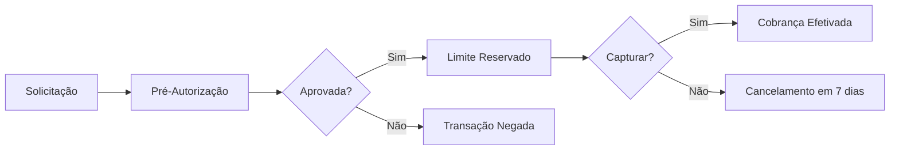
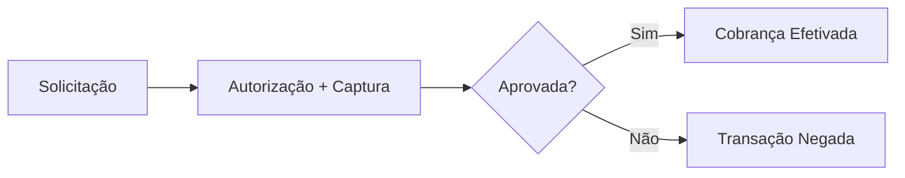

## Visão Geral

O FireBanking oferece **duas estratégias principais de autorização** para transações de cartão de crédito, permitindo flexibilidade na gestão de cobranças conforme as necessidades do seu negócio.

## Estratégias de Autorização

### 1. Pré-Autorização (Reserva de Limite)

A pré-autorização reserva o valor no limite do cartão sem efetuar a cobrança imediatamente.

<AccordionGroup>
  <Accordion title="Como Funciona">
    - O sistema reserva o valor no limite do cliente - O valor fica "bloqueado"
    mas não é debitado - A cobrança deve ser confirmada posteriormente via
    captura - Ideal para cenários que precisam de confirmação adicional
  </Accordion>

  <Accordion title="Casos de Uso">
    - Reservas de produtos ou serviços - Vendas que dependem de confirmação de
    estoque - Processos que requerem validação manual - Cobranças condicionais
  </Accordion>
</AccordionGroup>

**⚠️ Importante**: Transações pré-autorizadas são **automaticamente canceladas após 7 dias** se não forem capturadas.

### 2. Captura Imediata (Cobrança Direta)

A captura imediata processa a cobrança no momento da autorização.

<AccordionGroup>
  <Accordion title="Como Funciona">
    - O valor é imediatamente debitado do cartão - A transação é finalizada em
    uma única etapa - Não requer ação adicional para efetivação - Mais adequado
    para vendas diretas
  </Accordion>

  <Accordion title="Casos de Uso">
    - E-commerce tradicional - Vendas imediatas - Serviços digitais - Produtos
    com entrega garantida
  </Accordion>
</AccordionGroup>

## Gestão do Ciclo de Vida

### Fluxo de Pré-Autorização

### Fluxo de Captura Imediata

## Operações de Gestão

### Captura Manual

- Converte uma pré-autorização em cobrança efetiva
- Pode capturar valor parcial ou total
- Deve ser executada antes do vencimento (7 dias)

### Cancelamento

- **Pré-autorização**: Libera o limite reservado
- **Cobrança efetivada**: Inicia processo de estorno

### Estorno (Refund)

- Devolve valores já cobrados
- Pode ser parcial ou total
- Processado conforme regras do adquirente

## Considerações Importantes

<Warning>
  **Expiração de Pré-Autorizações**: Transações pré-autorizadas não capturadas
  em 7 dias são automaticamente canceladas pelo sistema, liberando o limite do
  cliente.
</Warning>

<Tip>
  **Escolha da Estratégia**: Use pré-autorização quando precisar de confirmações
  adicionais, e captura imediata para vendas diretas e confirmadas.
</Tip>

## Monitoramento e Controle

### Webhooks Relacionados

- `payment.authorized` - Autorização bem-sucedida
- `payment.captured` - Captura confirmada
- `payment.expired` - Pré-autorização expirada
- `payment.failed` - Falha na autorização

### Dashboard

Acompanhe suas transações em tempo real através do [Dashboard FireBanking](https://app.firebanking.io).

## Próximos Passos

- Configure [Webhooks](/concepts/webhooks) para acompanhar o status das transações
- Implemente [Tratamento de Erros](/concepts/error-handling) para diferentes cenários
- Explore as [APIs de Pagamento](/api-reference/payment/create) para implementação prática
