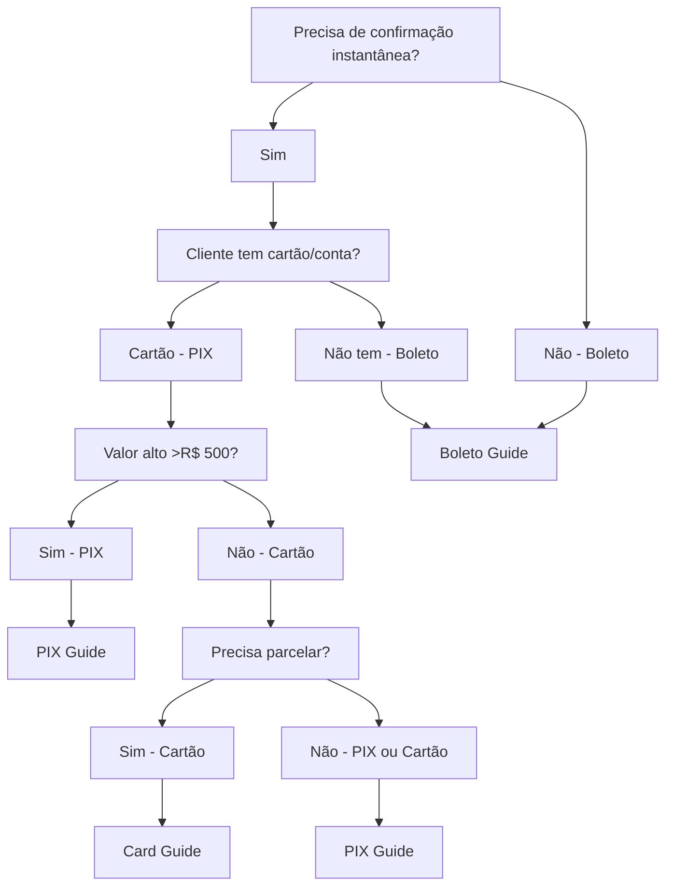

## Visão Geral

A FireBanking oferece múltiplos métodos de pagamento para atender diferentes necessidades de negócio. Cada método possui características únicas e é adequado para cenários específicos.

<CardGroup cols={3}>
  <Card title="Cartão de Crédito" icon="credit-card" href="/guides/integration/credit-card">
    **Instantâneo** • Taxa variável • Parcelamento
  </Card>
  <Card title="PIX" icon="qrcode" href="/guides/integration/pix">
    **Instantâneo** • Taxa baixa • 24/7
  </Card>
  <Card title="Boleto Bancário" icon="file-invoice" href="/guides/integration/bank-slip">
    **1-3 dias** • Taxa fixa • Ampla aceitação
  </Card>
</CardGroup>

## Comparação de Métodos

<AccordionGroup>
  <Accordion title="💳 Cartão de Crédito">
    **Características:**
    - ⚡ Confirmação instantânea
    - 💸 Taxa percentual sobre valor
    - 📅 Parcelamento em até 12x
    - 🔒 Pré-autorização disponível
    - 🔄 Assinaturas recorrentes

    **Ideal para:**
    - E-commerce e marketplace
    - Valores baixos e médios
    - Necessidade de confirmação imediata
    - Vendas parceladas
    - Assinaturas mensais/anuais

  </Accordion>

  <Accordion title="📱 PIX">
    **Características:**
    - ⚡ Confirmação em segundos
    - 💰 Taxa fixa baixa
    - 🕐 Disponível 24h/7 dias
    - 📱 QR Code ou chave PIX
    - 💼 Ideal para B2B

    **Ideal para:**
    - Pagamentos instantâneos
    - Valores médios e altos
    - Transferências entre empresas
    - Economia em taxas
    - Pagamentos urgentes

  </Accordion>

  <Accordion title="🏦 Boleto Bancário">
    **Características:**
    - 📅 Prazo de 1-3 dias úteis
    - 💰 Taxa fixa
    - 🏪 Pagável em qualquer banco
    - 📄 Comprovante físico
    - 📋 Sem necessidade de conta bancária

    **Ideal para:**
    - Clientes sem cartão
    - Valores altos `(>R$ 200)`
    - Pagamentos corporativos
    - Preferência por comprovante físico
    - Controle de fluxo de caixa

  </Accordion>
</AccordionGroup>


## Fluxo de Decisão



## Implementação Híbrida

Muitas empresas oferecem **múltiplos métodos** na mesma checkout para maximizar conversão:

<Steps>
  <Step title="Análise do Cliente">
    Identifique o perfil do cliente e valor da compra
  </Step>
  <Step title="Oferta Inteligente">
    Apresente os métodos mais adequados em ordem de prioridade
  </Step>
  <Step title="Fallback Strategy">
    Tenha métodos alternativos caso o principal falhe
  </Step>
</Steps>

## Valores Monetários

<Warning>
**Importante sobre representação de valores:**

Todos os valores monetários na API FireBanking são expressos em **formato decimal** (BRL):

- R$ 1,00 → `1.00` ou `1`
- R$ 10,50 → `10.50` ou `10.5`
- R$ 100,99 → `100.99`

**Exemplos práticos:**
```json
{
  "amount": 25.00,       // R$ 25,00
  "amount": 150.50,      // R$ 150,50
  "amount": 1999.90      // R$ 1.999,90
}
```

**Formatos aceitos:**
- Números inteiros: `20`, `100`, `1500`
- Decimais: `1.50`, `99.99`, `2500.75`
</Warning>

## Próximos Passos

<CardGroup cols={2}>
  <Card title="🚀 Começar com PIX" icon="qrcode" href="/guides/integration/pix">
    Ideal para quem quer menor custo e rapidez
  </Card>
  <Card title="💳 Começar com Cartão" icon="credit-card" href="/guides/integration/credit-card">
    Ideal para e-commerce e parcelamento
  </Card>
  <Card title="🏦 Começar com Boleto" icon="file-invoice" href="/guides/integration/bank-slip">
    Ideal para valores altos e B2B
  </Card>
  <Card title="⚙️ Integração Completa" icon="star" href="/guides/integration-flow">
    Implementar todos os métodos
  </Card>
</CardGroup>

---

**💡 Dica:** Recomendamos começar com **PIX** para implementação mais simples e menor custo, depois expandir para cartão de crédito conforme a necessidade de parcelamento.